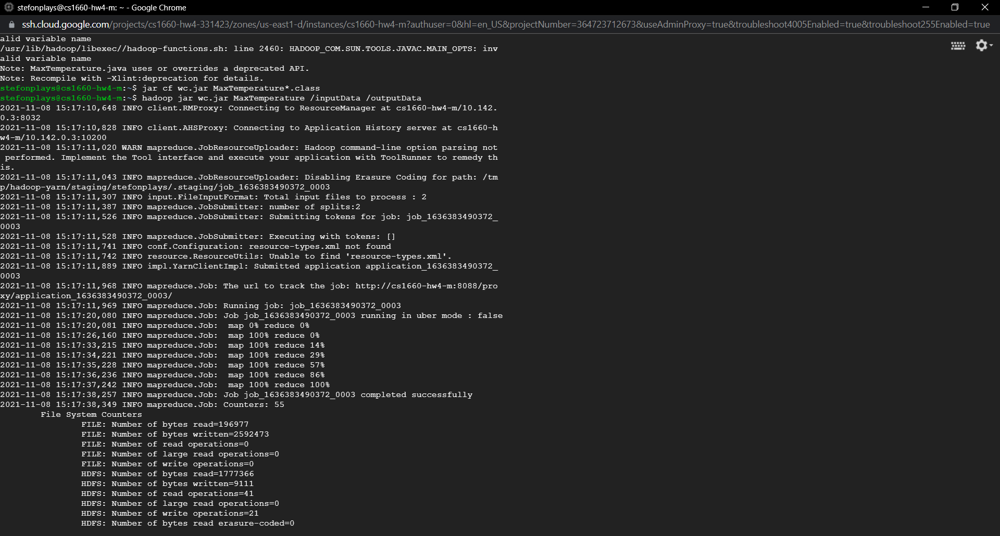

# CS1660-HW4

## Mapper/Reducer Java code
Code for my temperature mapper and reducer can be found in the ``MaxTemperature.java`` file

## Screenshot of execution on GCP

## Output of execution
Output of my mapreduce program can be found in the ``results.txt`` file

## Bonus demonstration
[Demo of my UI uploading files to GCP](https://www.youtube.com/watch?v=SYK9DpJ9AsI)
The Java code for the UI can be found in the ``FileUpload.java`` file
